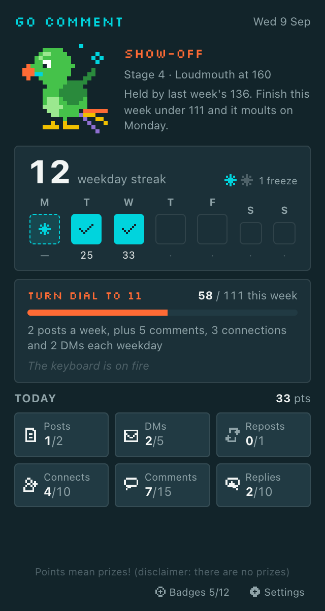
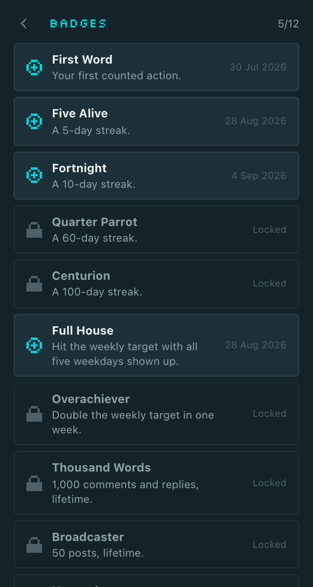
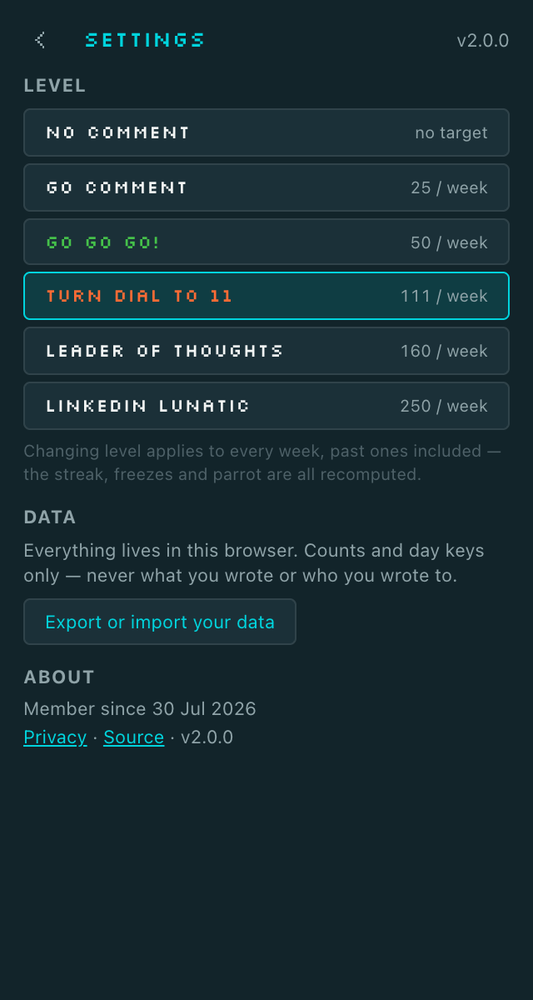

# Go Comment

Go Comment keeps score of your own activity on LinkedIn. It counts the comments, replies, posts,
reposts-with-thoughts, connection requests and messages you send, turns them into a
Monday-to-Friday streak with a weekly target, and shows the scoreboard in a toolbar popup. It
watches, it counts, it nags. It never acts for you, never paints anything on the page, and nothing
leaves your device.

Free and open source (MIT), for Chrome, Edge and Firefox.

Points mean prizes! *(disclaimer: there are no prizes)*

## The game

- **Streak.** A weekday counts as "shown up" once you've done one thing of any kind. Monday to
  Friday only: weekends never break a streak and never extend one. The toolbar badge shows your
  streak, and turns amber at 18:00 on a weekday you haven't shown up on yet.
- **Freezes.** Hit your weekly target and you earn a freeze (you can bank two). A freeze is spent
  automatically on the first weekday you miss, so the streak survives. You can't buy one and you
  can't place one by hand.
- **Points.** Post 8 · message 4 (first to each person that day) · repost with thoughts 3 ·
  connection request 2 · comment 1 · reply 1. Daily caps (2 / 5 / 1 / 10 / 15 / 10) make grinding
  any one action pointless; the ceiling is 84 a day. Capped actions still count towards the streak,
  they just score 0.
- **Levels** are weekly targets you pick yourself: No Comment (0) · Go Comment (25) · Go Go Go!
  (50) · Turn Dial to 11 (111) · Leader of Thoughts (160) · LinkedIn Lunatic (250).
- **Twelve badges**, earned once and never taken away.
- **A pixel parrot** with seven stages, from egg to crowned lunatic. Its stage is the highest
  target you hit this week or last, so it can moult back down. That is the joke.
- **Not counted, on purpose:** reactions and silent reposts. One click, unverifiable intent, and
  rewarding them rewards spam.

## Install

**From the Chrome Web Store** (Chrome and Edge):
[Go Comment](https://chromewebstore.google.com/detail/mbfoeohbgablnagjdamkilnjbogohjam). Pin it to
the toolbar so the streak badge is always in view.

**Or load a build yourself:**

1. Download the latest zip for your browser from
   [GitHub Releases](https://github.com/Phonografik/go-comment/releases) and unzip it.
2. Chrome or Edge: open `chrome://extensions` (Edge: `edge://extensions`), switch on
   **Developer mode**, click **Load unpacked** and pick the unzipped folder.
3. Firefox: open `about:debugging#/runtime/this-firefox`, click **Load Temporary Add-on** and pick
   the `manifest.json` inside the unzipped Firefox build. (Firefox removes temporary add-ons when
   it closes.)

Then open LinkedIn, do something, and click the toolbar icon.

## Screenshots

<table>
  <tr>
    <td></td>
    <td></td>
    <td></td>
  </tr>
  <tr>
    <td>Mid-week on Turn Dial to 11: the parrot, the streak (Monday covered by a freeze), the week so far, today's counts.</td>
    <td>Badges are earned once and never taken away.</td>
    <td>Settings: change level, export or import, privacy, version.</td>
  </tr>
</table>

Rendered from the real popup with a seeded history by `scripts/store-assets/render.mjs` (which also
produces the Chrome Web Store assets). Every number is what the rules engine derives from that seed.

## What it never does

Go Comment lives in a narrow gap: watching your own actions and counting them locally. Five rules
keep it there. The ones that can be enforced by a test are.

1. **It puts nothing on linkedin.com.** No badge, toast, counter or overlay on the page. Everything
   you see from Go Comment is in the popup or on its own settings page.
2. **It only watches.** It never clicks, types, posts, sends, connects or calls LinkedIn's APIs on
   your behalf. Nothing is automated, and nothing ever will be.
3. **It stores counts, not content.** The type of action, a timestamp and the day. Never the text
   of a post, comment or message; never a name, profile link or post id.
4. **It is network-silent.** No server, no analytics, no telemetry, no remote code. The only
   permissions it asks for are `storage` and `alarms`, and every build is scanned for network
   calls before it ships.
5. **It has no AI comment help.** No suggested replies, no drafts. The whole point is that you do
   the work yourself.

## Privacy

Nothing leaves your device. The full policy is in [PRIVACY.md](PRIVACY.md) and published at
[phonografik.github.io/go-comment](https://phonografik.github.io/go-comment/).

## How detection works

A click is a hint; a DOM outcome is the event. Go Comment records an action only when the page
itself shows it happened within a few seconds: the editor empties and your comment appears, the
Connect button turns to Pending, the share dialog closes without a discard prompt.

LinkedIn changed something and the counts stopped? The fix is one file plus a fixture. See
[CONTRIBUTING.md](CONTRIBUTING.md).

## Development

```
npm ci
npm run dev                        # Chrome with hot reload (npm run dev:firefox for Firefox)
npm run build                      # then load unpacked from .output/chrome-mv3
npm run verify                     # the gate
npx playwright install chromium    # once
npm run smoke                      # Playwright loads the built extension and drives the popup
```

`npm run verify` is the gate: typecheck, lint, unit tests, both builds, the manifest-equality test
(built permissions are exactly `storage` + `alarms`, content script on `https://www.linkedin.com/*`
only, no host permissions) and the no-network bundle scan. CI runs it on every push. A `v*` tag
builds the Chrome and Firefox zips into a GitHub Release.

Stack: [WXT](https://wxt.dev) + React + TypeScript + Tailwind, Vitest for unit tests, Playwright
for the smoke. One codebase builds Chrome, Edge and Firefox.

## Affiliation

Go Comment is an independent project and is not affiliated with, endorsed by, or sponsored by LinkedIn Corporation.

## Licence

MIT. See [LICENSE](LICENSE).
